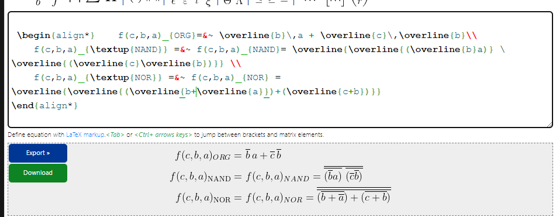
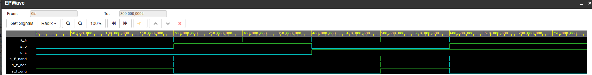
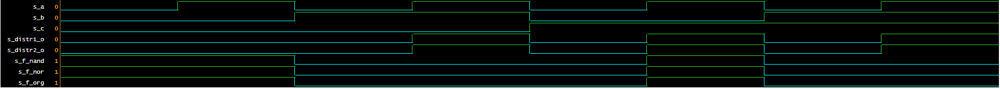

# Lab 1: PETER KONDAS

### De Morgan's laws

1. Equations of all three versions of logic function f(c,b,a):

   

2. Listing of VHDL architecture from design file (`design.vhd`) for all three functions. Always use syntax highlighting, meaningful comments, and follow VHDL guidelines:

```vhdl
architecture dataflow of gates is
begin
    f_org_o  <= (not(b_i) and a_i) or (not(c_i) and not(b_i));
    f_nand_o <= not((not(not(b_i) and a_i)) and (not(not(c_i) and not(b_i))));
    f_nor_o  <= not(not((not(b_i or not(a_i))) or (not(c_i or b_i))));
end architecture dataflow;
```
Screenshot of simulation from EdaPlayground:


3. Complete table with logic functions' values:

| **c** | **b** |**a** | **f(c,b,a)_ORG** | **f(c,b,a)_NAND** | **f(c,b,a)_NOR** |
| :-: | :-: | :-: | :-: | :-: | :-: |
| 0 | 0 | 0 | 1 | 1 | 1 |
| 0 | 0 | 1 | 1 | 1 | 1 |
| 0 | 1 | 0 | 0 | 0 | 0 |
| 0 | 1 | 1 | 0 | 0 | 0 |
| 1 | 0 | 0 | 0 | 0 | 0 |
| 1 | 0 | 1 | 1 | 1 | 1 |
| 1 | 1 | 0 | 0 | 0 | 0 |
| 1 | 1 | 1 | 0 | 0 | 0 |

### Distributive laws

1. Screenshot with simulated time waveforms.
 ### Second Distributive law
   

2. Link to your public EDA Playground example:

   [https://www.edaplayground.com/x/bqer](https://www.edaplayground.com/x/bqer)