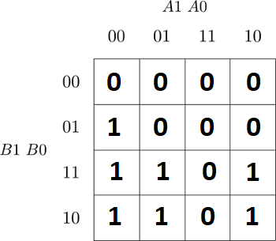
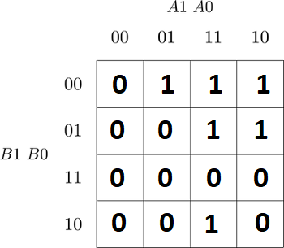

# Lab 2: Peter Kondas

### 2-bit comparator

1. Karnaugh maps for other two functions:

  *Greater than:*

   

   *Less than:*

   

2. Equations of simplified SoP (Sum of the Products) form of the "greater than" function and simplified PoS (Product of the Sums) form of the "less than" function.

   

### 4-bit comparator

1. Listing of VHDL stimulus process from testbench file (`testbench.vhd`) with at least one assert (use BCD codes of your student ID digits as input combinations). Always use syntax highlighting, meaningful comments, and follow VHDL guidelines:

   Last two digits of my student ID: **xxxx88**

```vhdl
     p_stimulus : process
    begin
        -- Report a note at the beginning of stimulus process
        report "Stimulus process started" severity note;

       -- First test case ID:xxxx88 (230588)
        	s_b <= "1000";     
        	s_a <= "1000";    
        
        wait for 100 ns;
        -- Expected output
        assert ((s_B_greater_A = '0') and
                (s_B_equals_A  = '1') and
                (s_B_less_A    = '0'))
        -- If false, then report an error
        report "Input combination was not correct and Failed (Chybne)" severity error;
        -- Report a note at the end of stimulus process
        report "Stimulus process finished(Správne)" severity note;
        wait;
        
    end process p_stimulus;
```

2. Text console screenshot during your simulation, including reports.
### 1. *Report of successfull process*
   
### 2. *Report of failed process*
   

3. Link to your public EDA Playground example:

   [https://www.edaplayground.com/x/faKn](https://www.edaplayground.com/x/faKn)